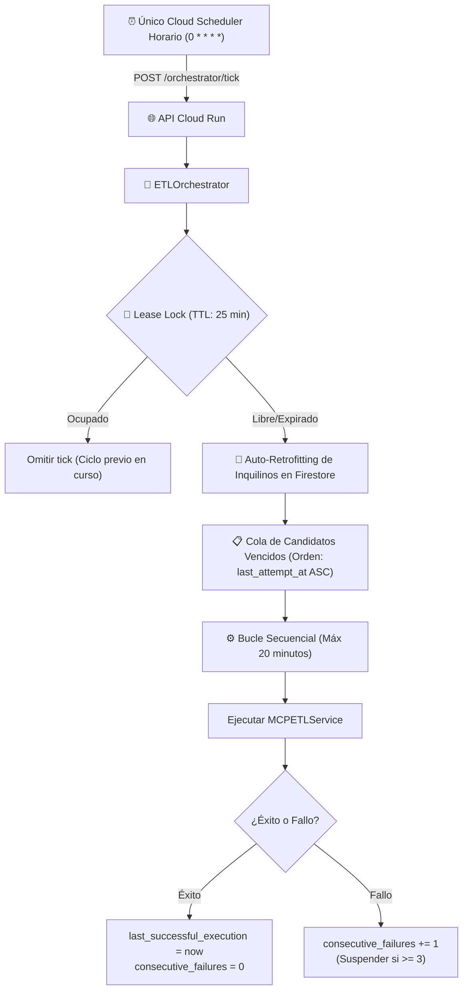

# Devlog: Orquestador Centralizado de ETL y Single Cloud Scheduler (Retrofitting Multi-Tenant)

- **Fecha:** 2026-09-09
- **Autor / Agente:** Antigravity AI
- **Tema:** Implementación del Orquestador Centralizado de ETL con Lease Lock, presupuesto de tiempo de 20 minutos, prevención de poison pills, retrofitting automático de inquilinos y monitoreo en el Admin Panel.

---

## 1. Contexto y Diagnóstico del Problema

Anteriormente, la plataforma intentaba programar un job individual de Google Cloud Scheduler (`mcp-etl-{tenant_id}`) cada vez que se creaba o actualizaba un cliente. Esto introducía severos problemas de estabilidad:
1. **Fragilidad de Permisos en GCP:** Exigía permisos de IAM amplios en tiempo de ejecución para crear/eliminar jobs remotos en Cloud Scheduler.
2. **Saturación y Desorden:** Con múltiples clientes, la cantidad de schedulers en GCP crecía descontroladamente.
3. **Falta de Control de Cuotas:** Si múltiples clientes se disparaban en paralelo, se saturaban las cuotas de peticiones de APIs externas (GA4, Adobe Analytics, Brandlight, Peec.ai).
4. **Falta de Resiliencia ante Fallos:** Si un cliente fallaba (por credenciales inválidas), bloqueaba o generaba ruido sin un mecanismo de aislamiento ni suspensión por reintentos fallidos (*Poison Pills*).

---

## 2. Arquitectura Implementada

Se adoptó una arquitectura **Single Heartbeat Scheduler** con **Cola Priorizada por Antigüedad** y **Control de Presupuesto de Tiempo**:

### Componentes Clave:
1. **Retrofitting & Auto-Migración de Inquilinos (`normalize_and_retrofit_tenant`):**
   - Garantiza que cualquier cliente preexistente adopte de forma transparente los nuevos campos (`enabled: true`, `sync_cadence: "daily"`, `preferred_hour_utc: 3`, `consecutive_failures: 0`, `is_running_now: false`).
   - Si no tenía fecha de última ejecución, busca en el histórico de `etl_runs` para inicializarla o la programa para primera ejecución.
2. **Candado Distribuido con Auto-Recuperación (Lease Lock TTL de 25 min):**
   - Almacenado en `_orchestrator_locks/hourly_lock` en Firestore.
   - Si una instancia de Cloud Run se reinicia abruptamente a mitad del proceso, el lock expira a los 25 minutos y la siguiente hora se ejecuta sin requerir intervención manual.
3. **Presupuesto Estricto de 20 Minutos (`MAX_BUDGET_SECONDS = 1200`):**
   - El bucle monitorea el tiempo transcurrido antes de procesar cada cliente.
   - Si se alcanzan los 20 minutos, corta la ejecución y difiere los clientes restantes para el siguiente ciclo.
   - Cloud Scheduler se configura con un deadline de 25 minutos (1500s), manteniéndose holgadamente por debajo del límite estricto de 30 minutos de GCP.
4. **Circuito Anti-Poison Pills:**
   - Cada intento actualiza `last_attempt_at`, rotando al cliente al final de la cola para que no monopolice el siguiente tick.
   - Al tercer fallo consecutivo (`consecutive_failures >= 3`), el cliente pasa a `ERROR_SUSPENDED` y se crea una alerta crítica en `etl_alerts`.
5. **Ejecución On-Demand Aislada y Reactivación:**
   - Botones en el Admin Panel para sincronización incremental (2 días) o Backfill (90 días).
   - Verificación de concurrencia a nivel de tenant (`is_running_now`).
   - Endpoint para reactivar clientes suspendidos reseteando el contador de fallos.

---

## 3. Archivos Creados y Modificados

| Archivo | Tipo | Descripción |
| :--- | :--- | :--- |
| `backend/app/services/mcp_analytics/etl_orchestrator.py` | [NEW] | Servicio central del orquestador, gestión de lease locks, filtrado por cadencia, normalizador `_parse_utc_datetime` y ejecución. |
| `scripts/setup_orchestrator_scheduler.py` | [NEW] | Script para aprovisionar el único Cloud Scheduler horario y eliminar jobs obsoletos. |
| `backend/tests/test_etl_orchestrator.py` | [NEW] | 11 pruebas unitarias certificando retrofitting, normalización UTC, TTL, bloqueos, cadencias y poison pills. |
| `backend/app/services/mcp_analytics/routes/admin_etl.py` | [MODIFY] | Añadidos endpoints `/orchestrator/tick`, `/run-tenant`, `/status`, `/resume-tenant` y `/reset-lock`. Retrofiteado `create_or_update_tenant_scheduler`. |
| `frontend/src/components/admin/EtlMonitorTab.tsx` | [MODIFY] | Tarjeta maestra del orquestador, métricas en vivo, botones de sync incremental/backfill y reactivación. |
| `frontend/src/components/admin/types.ts` | [MODIFY] | Extensión de `TenantConfig` con campos de cadencia, estado y fallos. |

---

## 4. Resolución de Incidencia: "can't subtract offset-naive and offset-aware datetimes"

- **Causa Raíz:** Al ejecutar la orquestación sobre inquilinos reales existentes en Firestore, los campos de timestamp (`last_successful_execution`, `completed_at` en `etl_runs` o timestamps manuales) se encontraban guardados sin indicador de huso horario (`offset-naive`, ej. `"2026-09-08 02:00:00"`). Al evaluar la cadencia (`is_tenant_due_for_sync`), Python intentaba restar `current_utc` (aware con `timezone.utc`) menos `last_dt` (naive con `tzinfo=None`), provocando un `TypeError`.
- **Solución Implementada:** 
  1. Se introdujo el método `@staticmethod _parse_utc_datetime(val)` que acepta strings ISO con o sin `Z`, formatos SQL con espacios, objetos `datetime` naive o aware, Timestamps de Firestore o epoch timestamps, forzando la conversión unívoca a datetime UTC offset-aware.
  2. Se blindaron todos los puntos de comparación temporal (`acquire_lease_lock`, `is_tenant_due_for_sync`, `run_tenant_on_demand`, `get_orchestrator_status` y `_lookup_latest_successful_run`).
  3. Se añadieron pruebas unitarias de regresión específicas (`test_parse_utc_datetime_handles_all_formats` y `test_is_tenant_due_for_sync_with_naive_datetime_never_crashes`).

---

## 5. Resultados de Verificación y Filtros de Calidad

1. **Frontend:**
   - `npm run build` ejecutado en `frontend/`: Compilación limpia, 0 errores TypeScript.
2. **Backend:**
   - `python3 -m py_compile` ejecutado sobre todos los archivos de Python modificados: 0 errores de sintaxis.
   - `pytest backend/tests/test_etl_orchestrator.py`: 13/13 pruebas PASADAS.
   - `pytest backend/tests/`: 66/66 pruebas en toda la suite PASADAS.

---

## 6. Resolución de Anomalías de Datos: Vidal & Vidal y Sanitas

### A. Diagnóstico Forense:
1. **Vidal & Vidal (Hueco del 2 al 6 de septiembre y Sesiones de IA Infladas):**
   - *Hueco de Fechas:* La sincronización incremental aplicaba una ventana fija de 2 días (`now - 2d`), por lo que si pasaban varios días sin ejecución, los días intermedios quedaban sin ingerir.
   - *Sesiones Infladas:* En `etl_service.py`, las métricas de `visibility_count` de Peec.ai (menciones de dominios en prompts de LLMs, ~500/día) se estaban sumando directamente a `ai_inferred_sessions` de tráfico web en `fact_traffic_evolution`.
2. **Sanitas (Falta de datos posteriores al 3 de septiembre):**
   - `adobe_service.py` fallaba al invocar `DEFAULT_HTTP_TIMEOUT` debido a un `NameError` (variable no importada).
   - `etl_service.py` tenía una colisión de ámbito local (*UnboundLocalError*) con `CalculationService` debido a un import local condicional dentro del bloque GA4.

### B. Soluciones Implementadas:
1. **Desacoplamiento Estricto de Fuentes de Datos (Política de Cero Mocks / Fidelidad):**
   - Se removió la inyección de `peec_inferred` en `merged_traffic`. `fact_traffic_evolution` ahora contiene única y exclusivamente sesiones reales de analítica web (GA4/Adobe).
   - Peec.ai ahora alimenta únicamente `fact_ai_visibility` (dominios y puntuaciones SOV) y `dim_content_recommendations` (temas y oportunidades de contenido).
2. **Corrección de Timeouts y Ámbitos de Módulos:**
   - Se definió `DEFAULT_HTTP_TIMEOUT = aiohttp.ClientTimeout(total=40.0, connect=10.0)` en `adobe_service.py`.
   - Se consolidó la importación de `CalculationService` a nivel de módulo en `etl_service.py`.
3. **Autosanación Dinámica de Brechas (Gap-Filling):**
   - Se implementó `_determine_gap_fill_dates(tenant_id, now_dt, max_lookback_days=14)` en el orquestador. Consulta BigQuery para detectar la primera fecha faltante en los últimos 14 días y expande dinámicamente `date_from`. Si no hay brechas, mantiene la ventana ágil de 2 días.
   - Se habilitó el soporte para `custom_date_from` y `custom_date_to` en peticiones manuales on-demand.

### C. Certificación en BigQuery Post-Remediación:
- **Sanitas:** Datos completos del 1 al 9 de septiembre recuperados directamente desde la Report Suite viva de Adobe (`vrs_sanita2_sanitasmayores`), con ~2,400 a 2,600 sesiones diarias y engagement scores calculados.
- **Vidal & Vidal:** Brecha de los días 2 al 6 de septiembre cerrada con datos de GA4. Días 7, 8 y 9 recalculados limpiamente sin contaminación de Peec (221, 495 y 184 sesiones de IA, 100% proporcionales al volumen diario de tráfico web).

---

## 7. Diagnóstico y Corrección de Despliegue en Cloud Run (Revision 00028-b9r)

- **Incidencia:** Fallo en el despliegue de Cloud Run con error `The user-provided container failed to start and listen on port 8080`.
- **Inspección Forense de Logs Remotos:**
  - Ejecutado `gcloud logging read "resource.type=\"cloud_run_revision\" AND resource.labels.revision_name=\"llyc-intelligence-api-00028-b9r\""`.
  - Causa Raíz: `NameError: name 'Optional' is not defined` en `admin_etl.py:1160` dentro del modelo Pydantic `RunTenantOnDemandRequest`.
- **Corrección:**
  - Se añadió `Optional` a la importación de `typing` en `backend/app/services/mcp_analytics/routes/admin_etl.py`.
  - Se creó la prueba unitaria `backend/tests/test_main_import.py` para verificar que la aplicación completa y todas sus subrutas se inicialicen sin excepciones de runtime.

