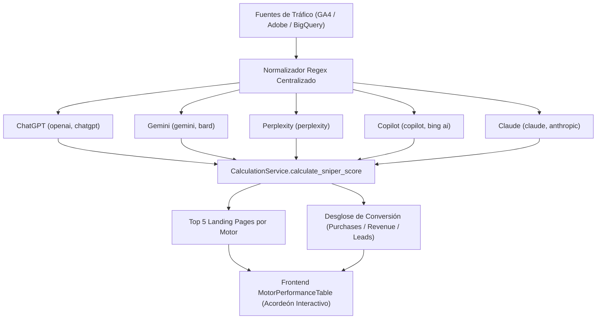

# LLYC Intelligence Dashboard — Manual Técnico de Arquitectura y Desarrollo

Este manual técnico proporciona una descripción exhaustiva de la arquitectura del sistema, el modelo de datos, la infraestructura serverless en **Google Cloud Platform (GCP)** y los estándares de desarrollo del **LLYC Intelligence Dashboard 2026**. Está destinado exclusivamente a ingenieros de software, administradores de sistemas y al equipo de TI corporativo.

---

## 🏛️ 1. Arquitectura General de la Plataforma

La plataforma está diseñada bajo un patrón arquitectónico unificado de **marca blanca, multiproveedor y multi-tenant**, implementado de forma 100% portable y desacoplada del código fuente:

```
                      [ *.analytics.llyc.global ] (DNS Firebase Hosting)
                                  │
                                  ▼ (SSL / TLS Automático)
                     [ Firebase Auth (JWT Tokens) ]
                                  │
                                  ▼ (Enrutamiento unificado /api/v1/)
                    ┌────────────────────────────┐
                    │    GCP Cloud Run Service   │ (Backend FastAPI)
                    │  (Dockerized Container)    │
                    └──────┬──────────────┬──────┘
                           │              │
        (Logos / SVGs)     ▼              ▼ (Metadata Tenants)
                   [ GCP Storage ]  [ GCP Firestore ]
                           │              │
      (Keys Encr.)         ▼              ▼ (ETL Daily Load / Part. tables)
               [ GCP Secret Manager ] [ GCP BigQuery ]
```

### Componentes de Infraestructura:
* **Frontend**: Single Page Application (SPA) en **React 19 + TypeScript + Vite**. Alojada en **Firebase Hosting** para resolver la propagación de DNS wildcard (`*.analytics.llyc.global`), enrutamiento sin CORS y certificados SSL automatizados.
* **Backend**: REST API robusta construida sobre **FastAPI (Python 3.11)**. Empaquetada de forma dockerizada y desplegada en **Google Cloud Run** en la región `us-central1`.
* **Autenticación**: Delegada en **Firebase Auth (Google OAuth 2.0)** con claim-filtering por dominio corporativo (`@llyc.global` y `@llyc.ai`).
* **Base de Datos NoSQL**: **Google Cloud Firestore (Native Mode)**, utilizada para almacenar configuraciones de marca visual (colores, logotipos, metadatos) de forma multi-tenant.
* **Criptografía de Credenciales**: **Google Cloud Secret Manager**. Guarda encriptadas las API Keys y tokens OAuth de los clientes.
* **Data Warehouse**: **Google Cloud BigQuery** (Dataset `media_impact_data`). Almacena de forma centralizada, estructurada e idempotente todo el histórico diario ingestada por el motor ETL.

---

## 💾 2. Modelo de Datos y Esquemas

### A. Base de Datos de Configuración (Firestore)
Colección centralizada: **`tenants`**
* **Documento ID**: `[tenant_id]` (ej: `sanitas`, `cocacola`).
* **Estructura**:
  ```json
  {
    "tenant_id": "string (REQUIRED, lowercase, clean)",
    "tenant_name": "string (REQUIRED, commercial name)",
    "logo_url": "string (REQUIRED, GCS public CDN URL)",
    "primary_color": "string (REQUIRED, hex color, ej: #0070B0)",
    "secondary_color": "string (REQUIRED, hex color, ej: #00A2E2)",
    "font_family": "string (REQUIRED, fallback 'Open Sans, sans-serif')",
    "support_email": "string (REQUIRED, soporte del inquilino)",
    "updated_by": "string (email del admin de LLYC)",
    "updated_at": "string (ISO timestamp UTC)"
  }
  ```

### B. Ecosistema de Ingesta (Google BigQuery)
Dataset unificado: **`media_impact_data`**  
*(Todas las tablas cuentan con particionamiento diario automático en el campo `date` para acelerar consultas y mitigar costos de computación en GCP).*

#### 1. Tabla: `fact_traffic_evolution` (Tráfico unificado GA4, Adobe y Peec.ai)
| Nombre del Campo | Tipo de Datos | Modo | Descripción |
| :--- | :--- | :--- | :--- |
| **`tenant_id`** | `STRING` | REQUIRED | ID único del cliente de LLYC |
| **`date`** | `DATE` | REQUIRED | Fecha de registro (Campo de Partición) |
| **`source`** | `STRING` | NULLABLE | Fuente de adquisición (ej: `google`, `chatgpt`) |
| **`medium`** | `STRING` | NULLABLE | Medio (ej: `organic`, `organic-ai`) |
| **`total_sessions`** | `INTEGER` | NULLABLE | Sesiones totales (Mapeadas de GA4/Adobe) |
| **`ai_referred_sessions`**| `INTEGER` | NULLABLE | Clics procedentes de motores de IA (Mapeado de Peec.ai) |
| **`ai_inferred_sessions`**| `INTEGER` | NULLABLE | Tráfico orgánico influenciado por IA (Mapeado de Peec.ai) |
| **`engagement_score`** | `FLOAT` | NULLABLE | Sniper score de LLYC (conversión e interacción) |

#### 2. Tabla: `fact_ai_visibility` (Visibilidad de IA unificada de Brandlight BI)
| Nombre del Campo | Tipo de Datos | Modo | Descripción |
| :--- | :--- | :--- | :--- |
| **`tenant_id`** | `STRING` | REQUIRED | ID único del cliente |
| **`date`** | `DATE` | REQUIRED | Fecha de registro (Campo de Partición) |
| **`domain`** | `STRING` | REQUIRED | Dominio analizado (marca o competidores) |
| **`visibility_score`** | `FLOAT` | NULLABLE | Score de visibilidad en motores de IA (0 a 100) |
| **`sentiment_score`** | `FLOAT` | NULLABLE | Score semántico reputacional de la marca (0 a 10) |
| **`share_of_voice`** | `FLOAT` | NULLABLE | Cuota de visibilidad frente a competidores (SoV) |

---

## ⚙️ 3. El Pipeline ETL e Inserción Idempotente

El servicio unificado **`MCPETLService`** implementa el flujo de **Extracción, Transformación y Carga** de forma asíncrona (`asyncio`):

1. **Extracción asíncrona multiproveedor**: Descarga de forma concurrente los datos de GA4 (via `GAService`), Adobe Analytics (via `AdobeAnalyticsService`), Peec.ai (via `PeecService`) y Brandlight (via `BrandlightService`), respetando los throttle limits respectivos (delay de seguridad preventivo de 1.5s).
2. **Idempotencia (De-duplication)**: Antes de realizar cualquier inserción JSON masiva (`insert_rows_json`), la clase `BigQueryService` ejecuta la consulta de borrado segura:
   ```sql
   DELETE FROM `[project_id].[dataset_id].[table_name]`
   WHERE tenant_id = @tenant_id AND date BETWEEN @start_date AND @end_date
   ```
   *Esto garantiza un pipeline idempotente libre de duplicados de datos ante re-ejecuciones.*

---

## 🎨 4. Inyección Dinámica de Estilos en el Frontend (Marca Blanca)

Para evitar la compilación y subida de una aplicación diferente por cliente, implementamos un patrón de **Inyección de Variables CSS en Caliente**:

1. En `index.css`, declaramos las variables básicas bajo `:root` en el navegador:
   ```css
   :root {
     --red: #F54963;
     --red-light: #FDE8EC;
     --teal: #36A7B7;
     ...
   }
   ```
2. En `tailwind.config.js`, configuramos los colores utilitarios para que hagan referencia directa a estas variables CSS de `:root` en lugar de valores hexadecimales estáticos:
   ```javascript
   red: {
     DEFAULT: 'var(--red)',
     light: 'var(--red-light)'
   }
   ```
3. En `App.tsx`, tras consultar el `/tenant/config`, sobreescribimos los valores de las variables en caliente en el documento HTML5:
   ```typescript
   document.documentElement.style.setProperty('--red', tenantData.primary_color);
   // Inyectar versión traslúcida al 10% de opacidad usando hex concat
   document.documentElement.style.setProperty('--red-light', tenantData.primary_color + '1A');
   ```
   *Esto recolorea automáticamente el 100% de las clases de Tailwind de toda la aplicación web en 1 milisegundo de forma nativa.*

---

## 🚀 5. Pipeline de CI/CD (GitHub Actions)

El workflow de CI/CD `.github/workflows/deploy.yml` está diseñado bajo un esquema **modular, secuencial, condicional e inteligente**:

* **Modularidad y Portabilidad**: No contiene nombres de proyectos GCP hardcodeados. Consume el secreto `${{ secrets.GCP_PROJECT_ID }}` de GitHub para que la API sea portátil a cualquier proyecto en caliente.
* **`detect-changes` (Job 1)**: Utiliza `dorny/paths-filter` para detectar de forma analítica en qué carpetas del repositorio se han subido cambios.
* **`deploy-backend` (Job 2)**: Se activa **únicamente** si existen cambios en la carpeta `backend/**`. Compila la imagen con el Dockerfile optimizado (`python:3.11-slim`) en Google Cloud Build y despliega en **GCP Cloud Run** (`llyc-intelligence-api`) en la región `europe-west1` / `us-central1`.
* **`deploy-frontend` (Job 3)**:
  - **Secuencialidad**: Espera a que el backend se despliegue con éxito (`success`) o sea omitido (`skipped`). Si el backend falla, bloquea el despliegue del frontend para evitar que la UI quede huérfana.
  - **Condicionalidad**: Corre **únicamente** si hay cambios en la carpeta `frontend/**`. Compila la SPA de React con Node 20+, inyecta las variables de entorno de Firebase desde GitHub Secrets en caliente, y la publica en **Firebase Hosting** bajo el canal de marca unificado.

---

## 🤖 6. Normalización Multicanal de Inteligencia Artificial (Battle of AIs)

El pipeline de ingesta y visualización homologa el tráfico procedente de los distintos ecosistemas generativos bajo una clave canónica `battle_of_ais`:



### Características Técnicas:
1. **Sniper Score Canónico**:
   \[ S(c, d, p) = B(c) + \frac{30}{\log_{10}((d \times p) + 10)} \]
   Garantiza puntuaciones representativas (sin fallbacks en 0) tanto para sesiones con conversiones como para sesiones de navegación cualificada.
2. **Top Landing Pages**: Cada motor expone en `landing_pages` sus 5 URLs prioritarias de destino con volumen de sesiones, porcentaje de cuota sobre el motor y tiempo medio en página.
3. **Desglose E-commerce**: Mapeo directo de `purchase` y `purchaseRevenue` para inquilinos con venta online, permitiendo cuantificar el retorno comercial exacto generado por cada IA.

---

## ⚡ 7. Compatibilidad React 19 y Renderizado de Canvas

Durante la migración a React 19, se identificó un conflicto en el ciclo de vida de componentes que montan gráficos HTML5 `<canvas>` (Chart.js):
* **Problema**: El modo estricto (`<StrictMode>`) desmonta y remonta componentes inmediatamente en desarrollo, provocando que librerías imperativas de canvas intenten manipular nodos desvinculados (`removeChildFromContainer` / `Failed to execute 'removeChild' on 'Node'`).
* **Solución Arquitectónica**:
  - En `main.tsx`, se gestiona la inicialización idempotente sobre `(rootElement as any)._reactRoot` para evitar errores de HMR duplicado.
  - El renderizado de la aplicación se encapsula directamente en `<ErrorBoundary>` sin el doble montaje de StrictMode sobre componentes con canvas imperativo.

---

## 🧪 8. Trazabilidad de Pruebas y Política de Cero Mocks

Siguiendo el estándar de gobernanza técnica de LLYC:
1. **Cero Mocks**: Ninguna métrica de visualización es generada de forma sintética o hardcodeada. Los estados sin datos se manejan mediante estados vacíos o badges `N/A`.
2. **Trazabilidad en Tests**: Toda validación de lógica de negocio o conectores de datos debe persistir en scripts `.py` dentro de `backend/tests/` ejecutables vía `pytest` (ej. `test_ai_engines_and_sniper.py`) y pruebas E2E de navegador en `frontend/tests/` (ej. `browser_check.cjs` con Playwright).

---

## 🔒 9. Seguridad, Privacidad y Cumplimiento Regulatorio (GDPR, HIPAA, SOC 2, ISO 27001)

La plataforma incorpora controles técnicos estrictos de ingeniería de seguridad y privacidad desde el diseño (*Privacy by Design*):

1. **Soberanía y Residencia de Datos en la Unión Europea (GDPR Capítulo V)**:
   - Los datasets y tablas de Google BigQuery se configuran con ubicación por defecto en la Unión Europea (`os.getenv("BQ_DATASET_LOCATION", "EU")`), garantizando el cumplimiento de la sentencia Schrems II y eliminando transferencias internacionales de datos hacia Estados Unidos.
2. **Limitación del Plazo de Conservación (GDPR Art. 5(1)(e))**:
   - Todas las tablas analíticas de hechos (`fact_traffic_evolution`, `fact_content_affinity`, etc.) cuentan con particionamiento diario por fecha y una política automática de caducidad de particiones de 730 días (`expiration_ms = 730 * 86,400,000`), purgando datos históricos más allá de los dos años acordados por contrato.
3. **Gestión Criptográfica Fail-Closed en Producción (SOC 2 CC6.1 / ISO 27001 A.10)**:
   - El módulo `EncryptionUtil` exige la inyección de `ENCRYPTION_KEY` o `SECRET_KEY` directamente desde Google Cloud Secret Manager cuando se ejecuta en producción (`K_SERVICE` o `ENVIRONMENT=production`). Se prohíbe de forma determinista la derivación de semillas predecibles en despliegues reales, abortando con `RuntimeError` en caso de omisión.
4. **Sanitización Proactiva de URLs anti-PHI/PII (HIPAA & GDPR Art. 9)**:
   - El módulo `sanitizer_utils.py` procesa todas las URLs de páginas de aterrizaje (`landingPagePlusQueryString`) antes de su persistencia en BigQuery o retorno en la API.
   - Filtra y elimina parámetros de consulta con palabras clave sensibles de salud o personales (`patient`, `paciente`, `diagnostico`, `medico`, `email`, `token`, `dni`, `card`), preservando la estructura limpia de rutas y etiquetas benignas de marketing (`utm_*`, `lang`).
5. **Pista de Auditoría Estructurada de Acceso a Inquilinos (SOC 2 CC7.2 / GDPR Art. 30)**:
   - La función `log_tenant_audit_event` emite registros estructurados en formato JSON etiquetados con `[AUDIT_LOG]` en Google Cloud Logging cada vez que un usuario consulta o intenta acceder a los datos de un inquilino, garantizando trazabilidad y no repudio ante auditorías formales.
